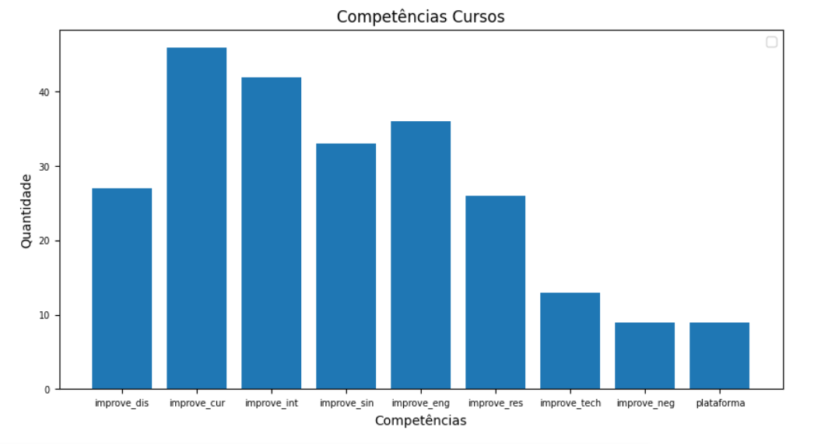

# Documentação Modelo Preditivo - Inteli
## BTech
### BTech
#### Bruno Conti, Daniel Mendez, Erik Silva, Fernando Machado, Izadora Luz e Marina Ladeira  

## Sumário
[1. Introdução](#c1)

[2. Objetivos e Justificativa](#c2)

[3. Metodologia](#c3)

[4. Desenvolvimento e Resultados](#c4)

[5. Conclusões e Recomendações](#c5)

[6. Glossário](#c6)

[7. Referências](#c7)

[Anexos](#attachments)


## <a name="c1"></a>1. Introdução  
&emsp; Fundada como uma *startup* pela Companhia de Talentos em 2016, o Bettha atua no mercado de Recursos Humanos. Seu propósito é orientar e conectar candidatos, principalmente em seu início de carreira, com vagas em empresas ideais para o seu perfil, oferecendo qualificações para desenvolver suas habilidades e melhorar sua empregabilidade. A empresa enfrenta alguns desafios cruciais no âmbito da precisão na correspondência entre candidatos e cursos, vide que um algoritmo para tal função ainda não está implementado, dificultando o acesso do usuário à capacitações que o auxiliariam no desenvolvimento de competências específicas. 
## <a name="c2"></a>2. Objetivos e Justificativa
### 2.1 Objetivos

&emsp; Através da aplicação de um modelo preditivo e baseando-se nos *insights* (percepções) gerados pelo modelo serão oferecidas recomendações de cursos específicos (dentro da plataforma do Bettha) que atendam às necessidades reais dos candidatos, buscando aprimorar as competências que apresentam um déficit em relação às requisições da área. Por exemplo, se um usuário realiza um dos testes de mapeamento comportamental e cognitivo, como o de Estilo de Vida, pode identificar a necessidade de aprimorar sua determinação para se destacar na vaga preterida. Neste caso, seria recomendado o curso "O Destemido Incansável - Lifestyle".

### 2.2 Proposta de solução

&emsp; A estratégia para alcançar os mencionados objetivos é fundamentada em um modelo preditivo que, utilizando as respostas de testes de mapeamento comportamental e cognitivo de empresas e usuários do Bettha, será treinado para recomendar, com precisão considerável, cursos para o cliente da plataforma baseando-se no perfil do candidato. Desse modo, esse modelo proporcionará oportunidades de desenvolvimento que estejam alinhadas com as habilidades técnicas e interpessoais pertinentes ao perfil do candidato.
   
&emsp; O escopo do projeto que o grupo pretende atingir até o final do módulo para recomendação dos cursos conta com quatro tópicos principais, são eles: 
   1. O que o mercado está procurando onde serão exibidos os cursos capazes de aprimorar aquelas habilidades e capacidades que as empresas do bettha mais valorizam.
   2. Mais populares em seus interesses, onde serão exibidos os cursos mais populares do bettha na(s)  área(s) de interesse do usuário
   3. Recomendados para o seu perfil, onde serão analisado o perfil do usuário e sua área de atuação, e com base nisso, serão sugerido cursos que podem aprimorar as habilidades menos desenvolvidas pelo usuário (conforme indicado pelo teste cognitivos *Superfits* e *Lifestyle*) e que são priorizadas pelas vagas em sua área.
   4. Todos os cursos, onde serão exibidos todos os curso da plataforma.
      
&emsp; A relação entre a solução e os dados recebidos estão melhores explicados na seção 4.2.3.

&emsp; A imagem a seguir consta com a representação da interface da solução:
<div align ="center">
   <p>Figura 1 - Mockup da área: Recomendações de Cursos</p>
   
   <p>Fonte: Elaborado pelos autores, 2023</p>
</div>

&emsp; Como uma das prioridades estabelecidas pelo projeto é a transparência com o usuário. Os ícones de informação amarelos presentes na interface são, na verdade, *hoovers* explicativos, que têm como principal objetivo elucidar o usuário de forma simples a lógica por trás das recomendações:
<div align ="center">
   <p>Figura 2 - Mockup da área: Recomendações de Cursos</p>
  
   <p>Fonte: Elaborado pelos autores, 2023</p>
</div>

### 2.3 Justificativa

&emsp; Através da implementação do modelo apresentado neste documento, será aprimorada de maneira significativa a acurácia da plataforma em relação à uma de suas principais funcionalidades: proporcionar capacitações alinhadas aos usuários e candidatos que estejam em sintonia com as necessidades das empresas contratantes. Paralelamente, essa abordagem também reforçará um dos diferenciais distintivos da plataforma: facilitar o contato entre pessoas que procuram trabalho e vagas baseando-se nas habilidades técnicas e interpessoais, moldados de acordo com o perfil de cada usuário. Em resumo, o produto do Bettha experimentará um aumento tangível em sua eficiência, o que, por sua vez, ampliará substancialmente suas perspectivas de crescimento.

   
## <a name="c3"></a>3. Metodologia
### **CRISP-DM** <br>
&emsp; Durante o desenvolvimento do projeto, a metodologia CRISP-DM (*Cross Industry Standard Process for Data Mining*) foi utilizada. Este método consiste em um conjunto de boas práticas a serem utilizadas quando se trata de Ciência de Dados, sendo subdividido em 6 passos iterativos:

**1 - Entendimento do negócio** - Nesta etapa, procura-se entender as necessidades do cliente e, consequentemente, definir o objetivo do projeto. Neste processo, são realizadas pesquisas de mercado de variados tipos, abrangendo aspectos internos e externos que permeiam a organização. Planeando como a solução impacta o cliente e qual valor ela agregará, as etapas consequentes podem ser realizadas de maneira assertiva.

**2 - Entendimento dos dados** - Etapa de entendimento da organização e variação dos dados. Saber da origem das informações e o significado das diferentes variáveis facilita o tratamento destas mesmas informações futuramente, agilizando o processo árduo de processamento e pré processamento.
	
**3 - Preparação dos dados** - Esta etapa precede a criação de um modelo matemático. Aqui, pretende-se preparar os dados de acordo com as necessidades da solução. Isto é feito através de uma padronização na amostragem dos dados (colocando todas as variáveis em uma mesma escala, por exemplo), retirada de *outliers* (dados extremamente distantes da média que impactam as medidas de análise descritiva), codificação (transformar amostragens em determinada linguagem ou alfabeto em outras representações para se adequar a situação), ou quaisquer outra medida.

**4 - Modelagem** - Após a realização satisfatória das etapas anteriores, chega-se à modelagem, etapa na qual se buscam as respostas para as problemáticas levantadas no entendimento do negócio. Neste passo, executam-se modelos matemáticos com os dados processados e são escolhidas as ferramentas que trabalharão com as features.

**5 - Avaliação** - Sendo definidos os modelos e testados, nesta etapa busca-se avaliar se os resultados obtidos são congruentes aos resultados esperados. Esta análise é feita a partir de métricas que variam em relação ao modelo escolhido anteriormente, sendo estas “Precisão”, “Revocação”, “F1 Score”, entre muitas outras.

**6 - Implementação** - Depois de apresentado às partes interessadas (stakeholders) e ter sido aprovado nas avaliações anteriores, o modelo é implementado, agregando, finalmente, valor real ao negócio. O principal propósito é fornecer ao usuário a possibilidade de inserir informações e receber resultados significativos. 


## <a name="c4"></a>4. Desenvolvimento e Resultados
&emsp; Aqui discutiremos os tópicos da compreensão do problema através de algumas análises de mercado que fizemos ( análise SWOT, 5 Forças de porter e value proposition canvas) também falaremos sobre os riscos e oportunidades que mapeamos para o projeto, as personas que desenvolvemos tendo em mente os usuários principais do projeto e suas respectivas jornadas com nosso produto, após isso falaremos sobre a política de privacidade do projeto e mostraremos alguns gráficos referentes a diversos tópicos, e alguns exemplos do mockup que montamos 
### 4.1. Compreensão do Problema
#### 4.1.1. Contexto da indústria 
|   | Quem são? | Quais ameaças | Quais as reações possíveis do Bettha? |
|--- |--- |--- |--- |
| F1 - Concorrentes Atuais | Linkedin, Vagas, Catho, Info, Jobs, Indeed, Trabalha e Brasil | (1) Por ser uma área com muitos concorrentes (alguns deles, como por exemplo o Linkedin e a Catho, com grande fatia do mercado), empresas e *startups* que não são tão disruptivas, como o Bettha, enfrentam dificuldades para manter a competitividade no mercado, dificultando o processo de diminuir a concorrência e tomar destaque significativo dentro do ramo <br/><br/> (2) O Trabalha Brasil, por ser um site do governo, apresenta como ameaça a prioridade quanto às informações de vagas para empregos federais/estaduais, isso os dá uma vantagem de não serem dependentes de empresas terceiras para oferecer empregos. <br/><br/> (3) No geral todas as plataformas, por estarem estruturadas no mercado a mais tempo, terem maiores equipes, e portanto terem maior entendimento da experiência do usuário, tem uma interface mais maleável e de boa funcionalidade.| Por estar chegando no mercado depois de outras grandes empresas seria interessante que o Bettha estudasse profundamente sobre as estratégias de suas precursoras. Desta forma, quando conseguisse suprir as necessidades dos clientes, seus diferenciais ficariam ainda mais em evidência. Portanto, é de fundamental importância que o Bettha aprimore seu *marketing* (fazendo que sua plataforma chegue em mais pessoas), trabalhe a navegabilidade do *site* (pois ainda está confuso e de difícil navegação, o que pode afugentar os usuários) e ampliar a possibilidade para contratantes, atraindo-lhes com menos taxas e expandindo o número de vagas disponíveis na plataforma. |
| F2 - Concorrentes Potenciais | Empresas que têm melhor pareamento e utilizam IA | Por ser uma plataforma com uma proposta relativamente simples, nada impede de aparecerem outras com funcionamento semelhante ou superior. Com isso, elas poderiam substituir o produto do Bettha, principalmente quando envolvem empresas que utilizem tecnologias novas e de grande impacto de forma mais eficiente, como por exemplo Inteligência artificial e capacidade de pareamento. | Uma possível reação poderia ser tentar, através de pesquisas e desenvolvimento interno da empresa, melhorar a ferramenta de pareamento entre clientes e empresas, utilizando, por exemplo, IA(Inteligência Artificial), modelo preditivo, etc. Outra possível reação seria a tentativa de aplicar novas tecnologias antes de outras empresas, mas, para isso, seria necessário muita pesquisa de mercado. |
| F3 - Produtos Substitutos | Recrutamentos internos | Sempre existem oportunidades de crescimento no *market share*, entretanto, neste caso, o alto número de concorrentes já consolidados pode ser um dificultador desse processo. Possíveis substitutos para a contratação do Bettha seriam os recrutamentos promovidos internamente pelas empresas, já que cerca de 90% dos novos usuários são trazidos por meio de recrutamentos empresariais com parcerias com o Bettha. | Intensificar os seus anúncios em diversas plataformas para aumentar sua influência e seu *market share*. |
| F4 - Fornecedores | Plataformas tecnológicas (como AWS, Visual Studio Code...), provedores de TI | Plataforma tecnológicas como a AWS são muito úteis, e, caso haja algum tipo de problema que os impeça de utilizar esses serviços, será de difícil substituição, porém a AWS é conhecida por ser confiável e bem estruturada, então a possibilidade de isso acontecer é baixa.<br/><br/>Por outro lado, os provedores de TI são mais maleáveis e propensos a fracassos, portanto há chances da internet cair ou dos provedores quebrarem contrato de alguma forma. | Se o Bettha tiver uma forte dependência de fornecedores específicos ou se houver poucas alternativas disponíveis no mercado, os fornecedores podem ter algum poder de barganha para impor preços ou condições. No entanto, se o Bettha tiver várias opções de fornecedores ou se puder desenvolver suas próprias ferramentas internamente, o poder de barganha dos fornecedores pode ser reduzido.<br/><br/>Como o poder de barganha de provedores de TI  é pequeno por ser um mercado abrangente, não se tem uma preocupação tão grande de lidar com suas possibilidades de falhas dos provedores atuais. Por outro lado, seria interessante o Bettha se atentar à criação de planos alternativos quanto ao fornecimento de internet e TI |
| F5 - Clientes | A Bettha possui como seus clientes os usuários da plataforma (profissionais de marketing, por exemplo, que busca uma vaga de emprego) |  O usuário pode ficar insatisfeito com o uso da plataforma e/ou culpar a Bettha  por não ter passado no processo seletivo de uma vaga falando que os cursos não prestam e etc | Ao usuário se cadastrar na plataforma, avisar que os cursos possuem o objetivo de capacitar ele. Mas que não é garantia que ao fazer os cursos da plataforma será aprovado para uma possível vaga. |

#### 4.1.2. Análise SWOT 

<div align ="center">
   <p>Figura 3 - Análise Swot</p>
   
   <p>Fonte: Elaborado pelos autores, 2023</p>
</div> <br>

&emsp; A análise SWOT (conhecida em tradução livre como FOFA) é uma ferramenta que pretende compreender a posição estratégica de determinada empresa em relação aos ambientes internos que a cercam, como a concorrência e janelas presentes no mercado. Este modelo analisa as Forças (*Strengths*), Fraquezas (*Weaknesses*), Oportunidades (*Opportunities*) e Ameaças (*Threats*) que trespassam o contexto da organização analisada e os organiza de maneira matricial.

Neste projeto, a tabela SWOT foi utilizada para o entendimento do Bettha (cliente da solução apresentada neste documento) assim podendo-se concernir sobre  a realidade da empresa em questão.

#### 4.1.3. Planejamento Geral da Solução


**a)** quais os dados disponíveis.

&emsp; Os dados disponíveis são provenientes dos testes realizados por candidatos, gestores e empresas e serão a base para a solução.

**b)** qual a solução proposta 

&emsp; A solução proposta, pela Btech, consiste em categorizar os dados e alinhá-los aos cursos correspondentes, facilitando a criação de correlações entre candidatos e capacitações. Além de trazer uma experiência lúdica e fácil tanto aos candidatos quanto às empresas.

**c)** qual o tipo de tarefa (regressão ou classificação).

&emsp; O tipo de tarefa é de classificação. A solução irá categorizar os dados que receber com as vagas adequadas.

**d)** como a solução proposta deverá ser utilizada.

&emsp; A solução proposta deverá ser utilizada para combinar curso e candidato. Após o candidato realizar os testes sociais e técnicos ficará disponível para ele quais cursos se encaixam no seu perfil, baseando-se nos déficits em relação à área de atuação. A solução oferecerá resultados precisos, trazendo uma interface mais objetiva e de fácil usabilidade.

**e)** quais os benefícios trazidos pela solução proposta.

&emsp; Os benefícios, presentes na solução proposta, impactarão, tanto as empresas quanto os candidatos, capacitando os últimos para as vagas. Assim, os candidatos encontrarão oportunidades adequadas ao seu perfil, enquanto as empresas receberão candidatos mais qualificados para suas vagas e, dessa forma, diminuindo o *turnover.*

**f)** qual será o critério de sucesso e qual métrica será utilizada para avaliá-lo.

&emsp; O critério de sucesso vai levar em consideração o modelo validado a partir do sistema de match entre pessoas e cursos.

#### 4.1.4. Value Proposition Canvas

<div align ="center">
   <p>Figura 4 - Value Proposition Canvas</p>
   
   <p> Fonte: Elaborado pelos autores, 2023 </p>
</div>
<br>
&emsp; *Value Proposition Canvas* é um framework desenvolvido pelo Dr. Alexander Osterwalder com o propósito de assegurar a correlação entre o perfil do cliente e o valor anexado ao produto. Costuma ser utilizado em vários âmbitos, mas principalmente na área de negócios, na qual se torna indispensável na construção de qualquer artefato.
&emsp; O VPC desenvolvido apresenta o intuito de alinhar a proposta do projeto com os desejos e necessidades do cliente (Bettha). Desta maneira, correlacionam-se as ineficiências e dores vivenciados pela empresa parceira (além dos seus intentos com a solução, obviamente) às entregas ofertadas pela BTech, garantindo assertividade e eficácia ao produto entregue.


#### 4.1.5. Matriz de Riscos

&emsp; A matriz de riscos é um processo de gerenciamento das ameaças de um projeto, o qual envolve planejamento, identificação, análise e desenvolvimento de respostas para o monitoramento e controle dos problemas. Com uma matriz de riscos, a equipe pode focar seus esforços de gerenciamento de riscos, focando naquelas de maior impacto e probabilidade de ocorrência. Dessa forma, aumenta-se a chance de potencializar os resultados. Podemos analisar na imagem 4 e 5 o nosso modelo de Matriz de Risco:

<div align ="center">
    <p> Figura 5 - Matriz de Oportunidades </p>
   
    <p> Fonte: Elaborado pelos autores, 2023 </p>
</div>

<div align ="center">
     <p> Figura 6 - Matriz de Riscos </p>
   
    <p> Fonte: Elaborado pelos autores, 2023 </p>
</div>


**MATRIZ DE RISCO**  
&emsp; **Não Entendimento da Proposta do Projeto -->** Por ser o nosso segundo encontro, ainda estamos nos habituando e entendendo os desejos e vontades por parte do Bettha. Então, é normal haver uma falta de compreensão por parte das partes em relação ao projeto até que haja um alinhamento de expectativas adequado - ademais, nas primeiras duas semanas, 1/4 do grupo Btech não estava presente. Solução: fazer a integração completa do grupo com o parceiro e compreender as suas vontades e desejos.  

&emsp; **Alinhamento de Expectativas -->** Nosso principal ponto nesta questão é unir o fazível com o possível. Portanto, é de suma importância, a fim do sucesso da parceria, o alinhamento de expectativas entre o grupo, Bettha e Inteli, prezando pela satisfação por todas as partes. Solução: ser direto e verdadeiro com o parceiro para melhorar a comunicação e evitar surpresas.
&emsp; **Falha na Comunicação (Inteli - Bettha) -->** Toda decisão e alinhamento, antes de vir para o grupo, passa pela aprovação, revisão e discussão entre o Inteli e o Bettha. Sendo assim, se ambas as partes tiverem conflitos e falhas na comunicação, o grupo será impactado diretamente no desenvolvimento do projeto. Solução: Conversas semanais, ao menos, entre Inteli-Bettha, valorizando, também, o feedback das equipes atuantes e os repassando ao cliente.  


**MATRIZ DE OPORTUNIDADES**  
&emsp; **Desenvolver um Canal Direto (Facilita a Comunicação) -->** Por termos o Inteli como o nosso mediador entre o Bettha, sempre há uma informação e/ou um detalhe que passa despercebido, então a existência de um canal direto entre o grupo-Bettha seria um gigantesco facilitador no desenvolvimento de uma solução.

#### 4.1.6. Personas
<div align = "center">
   <p>Figura 7 - Persona 1</p>
   
   <p>Fonte: Elaborado pelos autores, 2023</p>
   <p>Figura 8 - Persona 2</p>
   
   <p>Fonte: Elaborado pelos autores, 2023</p>
   <p>Figura 9 - Persona 3</p>
   
   <p>Fonte: Elaborado pelos autores, 2023</p>
</div>

#### 4.1.7. Jornadas do Usuário
<div align ="center">
    <p>Figura 10 - Jornada de Usuário 1</p>
    
    <p>Fonte: Elaborado pelos autores, 2023</p>
    <p>Figura 11 - Jornada de Usuário 2</p>
   
    <p>Fonte: Elaborado pelos autores, 2023</p>
    <p>Figura 12 - Jornada de Usuário 3</p>
   
    <p>Fonte: Elaborado pelos autores, 2023</p>
</div>

#### 4.1.8 Política de Privacidade
   **1. Informações sobre a empresa:**
   
&emsp; O Bettha, em conjunto com a Companhia de Talentos, é responsável pelo tratamento de dados, sensíveis também, do usuário. A empresa atua na área de recrutamento e seleção, oferecendo oportunidades de emprego, estágio, aprendizagem e desenvolvimento profissional.


   **2. Dados coletados**

&emsp; Os dados coletados pelo Bettha em relação aos possíveis candidatos são: <br>
a) Nome completo; <br> 
b) Número de Cadastro de Pessoa Física (CPF); <br> 
c) Endereço de e-mail; <br>
d) Número de telefone celular; <br> 
e) Grau de escolaridade;  <br>
f) Áreas de interesse; <br>
g) Conhecimento de idiomas;<br> 
h) CEP; <br>
i) Imagens e vídeos compartilhados voluntariamente;<br> 
j) Orientação sexual (opcional); <br>
k) Dados referentes à saúde (opcional);<br> 
l) Localização (opcional);<br>
m) Dados de voz (opcional).<br>


   **3. Onde os dados são coletados:**
   
&emsp; Os dados são coletados: na plataforma de cadastro, plataforma Bettha (testes de personalidade) e terceiros como LinkedIn, Gmail e Facebook.


   **4. Finalidade dos dados**
   
&emsp; O intuito com os dados coletados são para a realização de processos seletivos, jornadas de desenvolvimento profissional, convites para pesquisas e eventos relacionados à carreira, envio de links de terceiros para aprimoramento profissional, comunicação sobre ações e atividades no *site*, fornecimento e melhoria de conteúdo nos *sites* do GCT (empresa integrante do Grupo Cia de Talentos), envio de avisos técnicos e atualizações, resposta a comentários e dúvidas, e, por fim, análise de tendências de uso.


   **5. Armazenamento dos dados:**
   
&emsp; O armazenamento dos dados são feitos e responsáveis pela Plataforma Bettha e Companhia de Talentos.O seu período de armazenamento: Os dados fornecidos pelo usuário são mantidos indefinidamente, mas podem ser eliminados ou anonimizados a pedido do usuário.


   **6. Dados técnicos coletados:**
   
&emsp; Os dados técnicos coletados são: <br>
a) Informações de URL; <br>
b) Dados de cookies; <br>
c) Endereço IP do usuário; <br>
d) Tipos de dispositivos utilizados;<br>
e) Identificações exclusivas do dispositivo;  <br>
f) Atributos do dispositivo; <br>
g) Tipo de ligação à rede; <br>
h) Fornecedor de rede; <br>
i) Desempenho da rede e do dispositivo; <br>
j) Tipo de navegador; <br>
k) Idioma; <br>
l) Informações para gestão de direitos digitais;  <br>
m) Sistema operativo e versão da plataforma.


   **7. Compartilhamento de dados:**
   
&emsp; O compartilhamento de dados funciona da seguinte maneira: O Bettha e suas empresas associadas mantêm medidas de segurança para proteger dados pessoais contra acesso não autorizado, perda, destruição, alteração ou uso inadequado. Incidentes de segurança são informados ao titular e à Agência Nacional de Proteção de Dados (ANPD).


   **8. Direitos do Titular dos dados:**

&emsp; Os direitos do titular dos dados são: <br>
a) Confirmação de tratamento de dados; <br>b) Acesso aos dados; <br>c) Correção de informações;<br> d) Bloqueio ou eliminação de dados desnecessários;<br> e) Portabilidade dos dados;<br> f) Eliminação de dados pessoais tratados com consentimento; <br>g) Informação sobre entidades com quem os dados são compartilhados; <br>h) Revogação do consentimento.


   **9. Solicitação e exercer dados:**
   
&emsp; Para solicitar e exercer os dados, os titulares podem retirar o consentimento e excluir dados pessoais por meio do *site* do GCT ou das empresas controladoras.


   **10. Informações de contato da DPO:**

&emsp; As informações de contato da DPO, são: a) Responsável pela Proteção de Dados: lgpd@grupociadetalentos.com.br; b) Endereço: GRUPO CIA DE TALENTOS, Avenida das Nações Unidas, No. 12901, CENU Torre Norte, 11º andar, sala 11-133, Brooklin Paulista, São Paulo (SP), Brasil, CEP 04578-000.

### 4.2. Compreensão dos Dados

&emsp; A compreensão de um conjunto de dados é de extrema importância para a realização de um projeto baseado em um modelo preditivo. Com esse entendimento, é possível gerar hipóteses que podem aumentar a taxa de sucesso e a assertividade da solução criada. Com isso, foram seguidos os passos apresentados nos tópicos a seguir.

#### 4.2.1. Exploração de dados

 
Tabela: *_journeys_inteli_*

**Colunas Categóricas:**

1. `user_id`
2. `journey_id`
3. `improve_res`
4. `improve_cur`
5. `improve_emp`
6. `improve_tech`
7. `improve_sin`
8. `improve_dis`
9. `improve_int`
10. `improve_neg`
11. `plataforma`
12. `improve_eng`

**Colunas Numéricas:**

1. `average_rating`
2. `ratings_count`

|         | id     | average_rating | ratings_count | improve_res | improve_cur | emp   | improve_tech | improve_sin | improve_dis | improve_int | improve_neg | plataforma | improve_eng |
|---------|--------|----------------|---------------|-------------|-------------|-------|--------------|------------|------------|------------|------------|------------|-------------|
| count   | 131    | 131            | 131           | 131         | 131         | 131   | 131          | 131        | 131        | 131        | 131        | 131        | 131         |
| mean    | 355.94 | 4.80           | 1581.18       | 0.20        | 0.35        | 0.00  | 0.10         | 0.25       | 0.21       | 0.32       | 0.07       | 0.07       | 0.27        |
| std     | 260.41 | 0.26           | 8738.60       | 0.40        | 0.48        | 0.00  | 0.30         | 0.44       | 0.41       | 0.47       | 0.25       | 0.25       | 0.45        |
| min     | 23     | 4.00           | 1             | 0           | 0           | 0     | 0            | 0          | 0          | 0          | 0          | 0          | 0           |
| 25%     | 111.50 | 4.50           | 68.50         | 0           | 0           | 0     | 0            | 0          | 0          | 0          | 0          | 0          | 0           |
| 50%     | 310    | 5.00           | 190           | 0           | 0           | 0     | 0            | 0          | 0          | 0          | 0          | 0          | 0           |
| 75%     | 562.50 | 5.00           | 438           | 0           | 1           | 0     | 0            | 0.50       | 0          | 1          | 0          | 0          | 1           |
| max     | 884    | 5.00           | 93008         | 1           | 1           | 0     | 1            | 1          | 1          | 1          | 1          | 1          | 1           |


Tabela: *_user_interests_inteli_*

**Colunas Categóricas:**

1. `id`
2. `name`

Tabela: *_user_superfit_*

**Colunas Numéricas:**

1. `superfit_dis`
2. `superfit_sin`
3. `superfit_cur`
4. `superfit_int`
5. `superfit_eng`
6. `superfit_res`

**Colunas Categoricas:**

1. `id`

|          | id            | superfit_dis | superfit_sin | superfit_cur | superfit_int | superfit_eng | superfit_res |
|----------|---------------|--------------|--------------|--------------|--------------|--------------|--------------|
| count    | 73,959        | 73,959       | 73,959       | 73,959       | 73,959       | 73,959       | 73,959       |
| mean     | 1,043,977     | 57.33        | 49.86        | 44.04        | 52.18        | 48.23        | 51.20        |
| std      | 114,345       | 9.13         | 8.21         | 10.28        | 9.64         | 10.15        | 9.48         |
| min      | 990           | 0            | 0            | 0            | 0            | 2            | 4            |
| 25%      | 1,035,326     | 52           | 44           | 38           | 46           | 42           | 46           |
| 50%      | 1,063,767     | 58           | 50           | 44           | 52           | 50           | 52           |
| 75%      | 1,093,828     | 64           | 56           | 50           | 58           | 56           | 58           |
| max      | 1,130,183     | 90           | 90           | 94           | 92           | 90           | 88           |


Tabela: *_user_lifestyle_*

**Colunas Numéricas:**

1. `lifestyle_classic`
2. `lifestyle_order`
3. `lifestyle_change`
4. `lifestyle_tireless`
5. `lifestyle_explorer`
6. `lifestyle_specialist`
7. `lifestyle_generalist`
8. `lifestyle_hybrid`

**Colunas Categoricas**

1. `id`
2. `key`

|            | id           | lifestyle_classic | lifestyle_order | lifestyle_change | lifestyle_tireless | lifestyle_explorer | lifestyle_specialist | lifestyle_generalist | lifestyle_hybrid |
|------------|--------------|-------------------|-----------------|-----------------|-------------------|-------------------|----------------------|---------------------|-----------------|
| count      | 67,508       | 67,508            | 67,508         | 67,508         | 67,508            | 67,508            | 67,508               | 67,508              | 67,508          |
| mean       | 1,042,079    | 2.22              | 3.46           | 5.78           | 4.74              | 5.03              | 1.86                 | 1.47                | 0.88            |
| std        | 114,075      | 0.87              | 1.32           | 1.55           | 1.33              | 1.38              | 1.17                 | 1.11                | 0.93            |
| min        | 990          | 0.00              | 0.00           | 0.00           | 0.00              | 0.00              | 0.00                 | 0.00                | 0.00            |
| 25%        | 1,033,903    | 1.50              | 2.50           | 4.50           | 4.00              | 4.00              | 1.00                 | 1.00                | 0.00            |
| 50%        | 1,060,525    | 2.00              | 3.50           | 6.00           | 4.50              | 5.00              | 2.00                 | 1.00                | 1.00            |
| 75%        | 1,092,127    | 3.00              | 4.50           | 7.00           | 5.50              | 6.00              | 3.00                 | 2.00                | 1.00            |
| max        | 1,130,183    | 8.50              | 24.50          | 18.00          | 22.50             | 23.50             | 5.00                 | 5.00                | 4.00            |


Tabela: *_user_journeys_inteli_*

**Colunas Categóricas:**

1. `user_id`
2. `journey_id`

Tabela: *_job_opportunity_superfit_consolidates_*

**Colunas Numéricas:** 

1. `score_res`
2. `score_eng`
3. `score_int`
4. `score_cur`
5. `score_sin`
6. `score_dis`

**Colunas Categóricas:**

1. `id`
2. `job_opportunity_id`

|                 | id   | job_opportunity_id | score_res | score_eng | score_int | score_cur | score_sin | score_dis |
|-----------------|------|--------------------|-----------|----------|----------|----------|----------|----------|
| count           | 169  | 169                | 169       | 169      | 169      | 169      | 169      | 169      |
| mean            | 1899 | 2834               | 32.53     | 29.50    | 33.99    | 27.08    | 33.37    | 35.85    |
| std             | 48.93| 83.83              | 6.20      | 6.91     | 7.36     | 7.03     | 6.02     | 7.56     |
| min             | 1815 | 2666               | 16.00     | 10.00    | 16.00    | 12.00    | 16.00    | 8.00     |
| 25%             | 1857 | 2766               | 28.00     | 26.00    | 30.00    | 22.00    | 28.00    | 30.00    |
| 50%             | 1899 | 2834               | 32.00     | 30.00    | 34.00    | 26.00    | 34.00    | 36.00    |
| 75%             | 1941 | 2909               | 36.00     | 34.00    | 38.00    | 32.00    | 38.00    | 42.00    |
| max             | 1983 | 2967               | 46.00     | 46.00    | 52.00    | 46.00    | 48.00    | 52.00    |


Tabela: *_job_opportunity_workstyle_consolidates_*

**Colunas Numéricas: **

1. `score_classic`
2. `score_order`
3. `score_change`
4. `score_tireless`
5. `score_explorer`
6. `score_specialist`
7. `score_generalist`

**Colunas Categoricas:**

1. `id`
2. `job_opportunity_id`

|                 | id   | job_opportunity_id | score_classic | score_order | score_change | score_tireless | score_explorer | score_specialist | score_generalist | average_distance |
|-----------------|------|--------------------|---------------|-------------|-------------|----------------|----------------|------------------|-----------------|-----------------|
| count           | 168  | 168                | 168           | 168         | 168         | 168            | 168            | 168              | 168             | 0               |
| mean            | 1886 | 2833               | 1.61          | 4.24        | 4.33        | 4.11           | 3.33           | 2.14             | 2.14            | NaN             |
| std             | 48.64| 85.12              | 0.90          | 1.27        | 1.09        | 1.11           | 1.43           | 1.08             | 1.15            | NaN             |
| min             | 1803 | 2666               | 0.00          | 1.00        | 1.50        | 1.50           | 0.00           | 0.00             | 0.00            | NaN             |
| 25%             | 1845 | 2758               | 1.00          | 3.50        | 3.50        | 3.50           | 2.00           | 1.00             | 1.00            | NaN             |
| 50%             | 1886 | 2834               | 1.50          | 4.00        | 4.50        | 4.00           | 3.00           | 2.00             | 3.00            | NaN             |
| 75%             | 1928 | 2909               | 2.00          | 5.00        | 5.00        | 5.00           | 4.50           | 3.00             | 3.00            | NaN             |
| max             | 1970 | 2967               | 4.00          | 7.00        | 7.00        | 7.50           | 7.00           | 4.00             | 4.00            | NaN             |


 **Gráficos:**

&emsp; Abaixo constam os gráficos elaborados pela equipe BTech, com a intenção de melhorar a visualização dos dados oferecidos para o projeto e estabelecer hipóteses de uso com maior eficiência, com uma relação entre colunas escolhidas pelo grupo.

a) **Área profissional dos candidatos**<br>
&emsp; O gráfico a seguir é um gráfico de pizza que mostra a relação entre os candidatos da plataforma e suas respectivas áreas de interesse. Para a construção do gráfico, foram usadas informações da tabela "user_interests_inteli". <br>

&emsp; É importante ter essa métrica para a composição da solução da BTech, pois é essencial existir uma noção de como estão subdivididos os usuários entre as áreas, entendendo as preferências profissionais destes. Uma das soluções propostas pela equipe envolve a recomendação dos cursos de acordo com sua área de atuação, assim a visualização destes dados favorece o entendimento da resolução proposta pela equipe e confere uma métrica extra de averiguação e testagem.

<div align ="center">
   <p>Figura 13 - Porcentagem de usuários em cada área</p>
  
   <p>Fonte: Elaborado pelos autores, 2023</p>
</div>


Código referente ao gráfico:
```python
# Importando a biblioteca pandas para manipulação de dados e a biblioteca matplotlib.pyplot para visualização de gráficos
import pandas as pd
import matplotlib.pyplot as plt

# Carregando os dados do arquivo CSV
data_user_objectives = pd.read_csv(tabelas + "/user_interests_inteli.csv")

# Contando a quantidade de ocorrências de cada área profissional
values = data_user_objectives['name'].value_counts()

# Definindo as cores para cada fatia do gráfico
colors = ['blue', 'orange', 'green', 'red', 'purple', 'pink', 'brown', 'gray', 'cyan', 'magenta', 'yellow']

# Criando uma figura para o gráfico com tamanho 6x6
plt.figure(figsize=(6, 6))

# Estabelecendo o título
plt.title('Área profissional dos candidatos')

# Usando plt.pie() com as cores definidas
plt.pie(values, labels=values.index, autopct='%1.1f%%', startangle=90, textprops={'fontsize': 10}, colors=colors)
plt.axis('equal')

plt.show()

```
b) **Categorias de Cursos Oferecidos** <br>
&emsp; Esse gráfico mostra quantos cursos há em cada categoria pertencente. Para fazê-lo foram utilizados dados da tabela “journeys_inteli”. <br>

&emsp; Apesar de não terem relacão às categorias que o grupo vai utilizar para o projeto, já que eles não são subdivididos por áreas, a análise do gráfico é importante para haver uma visualização das subdivisões de categorias oferecidas pelo *site*.

<div align ="center">
   <p>Figura 14 - Categorias de cursos oferecidos</p>
  
   <p>Fonte: Elaborado pelos autores, 2023</p>
</div>

&emsp; Código referente ao gráfico:
```python
# Importa a função autoviz da biblioteca google.colab
from google.colab import autoviz

# Define uma função chamada categorical_histogram que recebe um DataFrame, o nome de uma coluna,
# o tamanho da figura e o nome da paleta de cores como parâmetros
def categorical_histogram(df, colname, figscale=1, mpl_palette_name='Dark2'):
    # Cria uma nova figura com tamanho baseado no valor de figscale
    plt.figure(figsize=(8*figscale, 4.8*figscale))

    # Agrupa os dados do DataFrame pela coluna especificada (colname) e cria um histograma de barras horizontais (barh)
    # Usa uma paleta de cores do matplotlib baseada no nome fornecido (mpl_palette_name)
    ax = df.groupby(colname).size().plot(kind='barh', color=sns.palettes.mpl_palette(mpl_palette_name))

    # Remove as bordas superior e direita do gráfico
    plt.gca().spines[['top', 'right']].set_visible(False)

    # Adiciona um título ao gráfico
    plt.title("Categorias de Cursos Oferecidos")

    # Adiciona um label ao eixo x para indicar a quantidade de cursos
    plt.xlabel("Quantidade de Cursos")

    # Define a mensagem do eixo y como "Tipo"
    plt.ylabel("Tipo")

    # Ajusta o tamanho da fonte dos rótulos nos eixos x e y
    plt.xticks(fontsize=12)
    plt.yticks(fontsize=12)

    # Exibe o gráfico
    plt.show()

    # Retorna um objeto MplChart criado a partir do estado atual do matplotlib
    return autoviz.MplChart.from_current_mpl_state()

# Chama a função categorical_histogram com um DataFrame chamado df_encoded e o nome da coluna 'type'
chart = categorical_histogram(df_encoded, *['type'], **{})
```

c) **Estilo de vida** <br>
&emsp; O gráfico mostra quantas vezes foram atribuídas pontuações mais altas para certos estilos de vida. Vale ressaltar que cada pessoa possui dois _lifestyles_ diferentes, um dominante e outro regressivo. <br>

&emsp; O gráfico em questão mostra apenas o _lifestyle_ dominantes, dessa forma observa-se que as categorias “explorer”, “specialist”,  “generalist” e “hybrid” não tem valores, pois até o momento não são dominantes de ninguém. É interessante notar que das quatro categorias nulas, três delas fazem parte do grupo 2, que se referem ao estilo de trabalho.<br>

&emsp; É importante ter posse dessas informações para o projeto, pois se qualificam dentro do escopo de recomendação de cursos para um perfil específico, mais informações sobre essa questão podem ser encontradas no tópico c, na seção 4.2.4 - Hipóteses.

<div align ="center">
   <p>Figura 15 - Estilo de vida do usuário</p>
  
   <p>Fonte: Elaborado pelos autores, 2023</p>
</div>

Código referente ao gráfico:
```python
# Criação de subplots, criando uma figura e um eixo (subplot) dentro da figura
fig, ax = plt.subplots(1, figsize=(10, 5))

# Obtém as chaves (estilos de vida) e valores (quantidades) do dicionário contador_lifestyle_users
lifestyles = list(contador_lifestyle_users.keys())
quantities = list(contador_lifestyle_users.values())

# Cria um gráfico de barras no subplot (eixo)
bars = ax.bar(lifestyle, quantities, label='Quantidade por estilo de vida')

# Define o título do gráfico
ax.set_title('Estilo de Vida do Usuário')

# Define o rótulo do eixo x
ax.set_xlabel('Estilo de Vida')

# Define o rótulo do eixo y
ax.set_ylabel('Quantidade')
plt.xticks(fontsize=12)
plt.yticks(fontsize=12)

# Adicione uma legenda com base nos rótulos fornecidos anteriormente
ax.legend()

# Mostra o gráfico
plt.show()
```

d) **Estilo de Trabalho das Vagas** <br>
&emsp; Da mesma forma que o gráfico Estilo de Vida do Usuário, o Estilo de Trabalho das Vagas trata de como funciona as empresas, tendo possibilidades semelhantes ao dos usuários. A principal diferença entre elas é que as empresas não têm o estilo de trabalho híbrido presente para os candidatos. <br>

&emsp; As informações sobre o workstyle foram tiradas da tabela “job_opportunity_workstyle_consolidates”. <br>

&emsp; É importante esses dados por motivos semelhantes ao do Estilo de Vida, anteriormente mencionado, pois, a partir das informações de trabalhos oferecidos pelo banco de dados, e agora exibidos pelos gráficos, é possível fazer as relações necessárias entre vagas e usuários, que serão necessárias para as soluções “O que o mercado está procurando” e “Recomendados para o seu perfil”, que serão melhores exemplificadas na seção 2.4.3 - Hipóteses.

<div align ="center">
   <p>Figura 16 - Estilo de trabalho das vagas</p>
  
   <p>Fonte: Elaborado pelos autores, 2023</p>
</div>

Códigos referente ao gráfico:
```python
# Criação de subplots, criando uma figura e um eixo (subplot) dentro da figura
fig, ax = plt.subplots(nrows=1, ncols=1)

# Lista de estilos de trabalho (workstyles)
workstyle = ['classic', 'order', 'change', 'tireless', 'explorer', 'specialist', 'generalist']

# Lista de valores correspondentes aos escores de cada workstyle
values_workstyle = [contador_workstyle_job['score_classic'], contador_workstyle_job['score_order'],
                    contador_workstyle_job['score_change'], contador_workstyle_job['score_tireless'],
                    contador_workstyle_job['score_explorer'], contador_workstyle_job['score_specialist'],
                    contador_workstyle_job['score_generalist']]

# Cria um gráfico de barras no subplot (eixo) com os estilos de trabalho no eixo x e os valores no eixo y
ax.bar(workstyle, values_workstyle)

# Define o título do gráfico
ax.set_title('Workstyle job')

# Define o rótulo do eixo x
ax.set_xlabel('Estilo de Trabalho das Vagas')

# Define o rótulo do eixo y
ax.set_ylabel('Quantidade')

# Ajusta o tamanho da fonte dos rótulos no eixo x e y
plt.xticks(fontsize=10)
plt.yticks(fontsize=10)

# Exibe o gráfico
plt.show()
```

e) **Competências Cursos** <br>
&emsp; Esse gráfico mostra aquelas competências que os cursos aprimoram. Essas informações são importantes para que o escopo do projeto fosse atingido, porém não constam no banco de dados apresentados pelo cliente, portanto foi necessário acrescentá-las manualmente, utilizando como base as colunas presentes na tabela “job_opportunity_workstyle_consolidates”. Essas informações foram salvas na tabela “journeys_inteli”, que é referente aos cursos.

<div align ="center">
   <p>Figura 17 - Competências dos cursos</p>
  
   <p>Fonte: Elaborado pelos autores, 2023</p>
</div>

&emsp; Códigos referente ao gráfico:
```python
# Criação de subplots, criando uma figura e um eixo (subplot) dentro da figura
fig, ax = plt.subplots(1, figsize=(10, 5))

# Criação de um gráfico de barras no segundo subplot (ax[1])
# Usando as chaves do dicionário compet_data como valores no eixo x
# E os valores do dicionário compet_data como valores no eixo y
ax.bar(compet_data.keys(), compet_data.values())

# Define o título do gráfico
ax.set_title('Competências Cursos')

# Define o rótulo do eixo x
ax.set_xlabel('Competências')

# Define o rótulo do eixo y
ax.set_ylabel('Quantidade')

# Ajusta o tamanho da fonte dos rótulos no eixo x e y
plt.xticks(fontsize=7)
plt.yticks(fontsize=7)

# Adiciona uma legenda ao gráfico
plt.legend()

# Exibe o gráfico
plt.show()
```

f) **Top 10 Cursos com Mais Visualizações** <br>
&emsp; Nesse gráfico, são mostrados os cursos que têm o maior número de ratings dentro da plataforma. Para criá-lo, foi necessário fazer uma análise na tabela “journeys_inteli” e utilizar a coluna “ratings_count” para determinar quais cursos foram mais avaliados pelos usuários da plataforma. Vale ressaltar que o grupo desconsiderou dados cujas as colunas com “emp” = 1, pois se trata de cursos com informações de empresas, irrelevantes para o projeto. <br>

&emsp; Essas informações trazidas pelo gráfico são importantes para o escopo do projeto no que se refere a segunda solução proposta “Mais populares em seus interesses”, que vai mostrar aqueles cursos mais populares nas áreas de interesse do usuário, é importante ressaltar que no gráfico apresentado não está separado por área ainda, como é o objetivo para a entrega final.

<div align ="center">
   <p>Figura 18 - Top 10 Cursos com Mais Avaliações</p>
  
   <p>Fonte: Elaborado pelos autores, 2023</p>
</div>

&emsp; Códigos referente ao gráfico:
```python
# Criação de um dicionário vazio para armazenar os dados de cursos e visualizações
cursos_visu = {
    "name": [],
    "visu": []
}


# Preenchimento do dicionário com dados do DataFrame df_encoded
cursos_visu["name"] = df_encoded["name"].tolist()
cursos_visu["visu"] = df_encoded["ratings_count"].tolist()

# Conversão da coluna 'ratings_count' para o formato numérico e criação de um DataFrame chamado visualizacoes
visualizacoes = pd.DataFrame(cursos_visu)

# Ordenação do DataFrame visualizacoes pelo valor de visualizações em ordem decrescente
visualizacoes = visualizacoes.sort_values(by='visu', ascending=False)

# Seleção dos 10 cursos com mais visualizações
maiores = visualizacoes.head(10)

# Criação de uma figura e um eixo (subplot) dentro da figura
fig, ax = plt.subplots(figsize=(10, 6))

# Criação de um gráfico de barras horizontais (horizontal bar chart)
bars = ax.barh(maiores['name'], maiores['visu'], color='skyblue')

# Inversão da ordem dos cursos para que o curso com mais visualizações fique no topo
ax.invert_yaxis()

# Definição do título do gráfico
ax.set_title('Top 10 Cursos com Mais Avaliações
')

# Definição do rótulo do eixo x
ax.set_xlabel('Quantidade de Visualizações')

# Ajuste de layout para melhor apresentação
plt.tight_layout()

# Exibição do gráfico
plt.show()
```

g) **Valores mais frequência em Workstyle das Vagas** <br>
&emsp; Esse gráfico, em específico, analisa quais as característica que cada vaga tem em maior valor dentro da tabela “job_opportunity_workstyle_consolidates”, foi feita a somatória desses valores e apresentado um gráfico contendo o número de vezes que cada competência tem valor mais alto dentro da tabela. <br>

&emsp; Essa informação é interessante na hora de determinar as tendências de mercado, por exemplo, entende-se que o “score_dis”, ou seja consistência, é a competência com score mais alto nas empresas clientes da Bettha e, portanto, muitas vezes as mais exigidas pelo mercado interno.

<div align ="center">
   <p>Figura 19 - Mockup da área: Recomendações de Cursos</p>
  
   <p>Fonte: Elaborado pelos autores, 2023</p>
</div>

&emsp; Códigos referente ao gráfico:
```python
# Imprime o dicionário contador_superfit_job
# O dicionário parece conter contagens de competências específicas associadas a vagas de emprego
print(contador_superfit_job)

# Criação de listas de rótulos e valores a partir do dicionário contador_superfit_job
rotulos = list(contador_superfit_job.keys())   # Lista de competências (rótulos)
valores = list(contador_superfit_job.values())  # Lista de contagens (valores)

# Criação de um gráfico de barras utilizando os rótulos e valores
# Os rótulos (competências) serão exibidos no eixo x e os valores no eixo y
plt.bar(rotulos, valores)

# Definição do rótulo do eixo x
plt.xlabel('Competências')

# Definição do rótulo do eixo y
plt.ylabel('Número de vezes como valor mais alto')

# Definição do título do gráfico
plt.title('Valores mais frequência em Workstyle das Vagas')

# Exibição do gráfico
plt.show()
```


#### 4.2.2. Pré-processamento dos dados  
&emsp; Para realizar o processamento usamos o Google Colab, decidimos em conjunto quais coluna iremos utilizar em nossa solução e com base nisso, dividimos as tarefas para realizar o processamento. 
&emsp; A primeira etapa for renomear uma coluna da tabela de cursos da plataforma. Em seguida, foi criada uma tabela composta: os objetivos do usuário com suas competências (user_interests e user_superfit), para que se possa analisar como os dois se relacionam. 
Viabilizar nossa solução exigiu a associação dos cursos com as competências que eles trabalham, com base no superfit. Após a conclusão dessa etapa, foi feita a transformação das colunas categóricas em numéricas. Para isso, uma coluna individual é gerada para cada competência. Se competência estiver presente no curso, contém 1; caso contrário, contém 0. Então, a coluna categórica original das competências é apagada e uma nova tabela é gerada.  
&emsp; A etapa de limpeza de dados, conhecida como _Data Cleaning_, desempenha um papel crucial no projeto, pois clarifica os dados para a execução do trabalho. Ela envolve correções para assegurar análises precisas e confiáveis. Dados limpos minimizam erros e otimizam a manipulação do dataset. A limpeza de dados é essencial para alcançar o melhor resultado no projeto. Logo, com o nosso pré-processamento dos dados conseguiremos trabalhar com eles de forma mais eficiente. As seguintes etapas foram seguidas:

   Tabela: *_job_opportunity_workstyle_consolidates_*

   * Abertura da tabela através do método _read_csv_ da biblioteca pandas. 

   Tabela: *_job_opportunity_superfit_consolidates_*

   * Abertura da tabela através do método _read_csv_ da biblioteca pandas.
   * Remoção das coluans _average_distance_, _updated_at_ e _created_at_ .
   
   Tabela: *_user_journeys_inteli_*

   * Abertura da tabela através do método _read_csv_ da biblioteca pandas.
   * Renomeação da coluna _user_id_ para _id_, isso pois facilitará o merge de tabelas no futuro

   Tabela: *_user_lifestyle_*

   * Abertura da tabela através do método _read_csv_ da biblioteca pandas.

   Tabela: *_user_superfit_*

   * Abertura da tabela através do método _read_csv_ da biblioteca pandas.
   * _merge_ com a tabela abaixo

   Tabela: *_user_interests_inteli_*

   * Abertura da tabela através do método _read_csv_ da biblioteca pandas.
   * Remoção da coluna _key_
   * _merge_ com a tabela acima

   Tabela: *_journeys_inteli_*

   * Abertura da tabela através do método _read_csv_ da biblioteca pandas.
   * Separação das strings da coluna competencias.
   * conversão das strings em colunas.
   * Remoção de dados com _emp_ = 1.


#### 4.2.3. Hipóteses
&emsp; O produto final que o grupo BTech pretende entregar inclui uma solução para a área de recomendações de cursos do Bettha (ver o _Mockup_ completo presente na seção 2.2). Desta forma, o usuário poderá visualizar quatro áreas distintas na página de cursos, que incrementarão sua jornada dentro do _site_ e ampliarão o escopo da empresa. Segue a descrição da relação entre os dados entregues e aqueles que serão utilizados neste projeto para a resolução da problemática trazida pelo cliente:

a) **O que o mercado está procurando.** <br>

&emsp; Nesta seção, o usuário poderá estar atualizado quanto às habilidades que o mercado mais valoriza, sendo-lhe oferecidos cursos capazes de potencializar as competências procuradas na sua área de atuação. Desta maneira, o usuário é capaz de se destacar no mercado com as características que este mais valoriza.
Para conseguir alcançar este objetivo, deve-se estabelecer, primeiramente, quais são as competências que o mercado mais valoriza. Para isso nós analisamos o perfil da empresa com o banco de dados "job_opportunity_superfit_consolidates", conferindo quais *scores* tem a maior média, ou seja, quais as médias de *scores* (entre score_res, score_eng, score_int, score_cur, score_sin e score_dis) são maiores. Assim, foi possível definir quais características são tendências no mercado. 

&emsp; A partir disto, será possível cruzar as informações adquiridas com as presentes na tabela "journeys_inteli" (uma planilha de dados que acompanha as informações quanto aos cursos), recomendando dessa forma os cursos capazes de melhorar as características mais valiosas do mercado. 

&emsp; Inicialmente, a tabela "journeys_inteli" não havia informações sobre as competências que cada curso, jornada ou aula estava implementando, assim, o grupo teve a tarefa de incrementá-la com estas informações manualmente, seguindo a seguinte lógica:
<br>

improve_sin -> aprimora agilidade e praticidade<br>
improve_tech -> aprimora habilidades tecnológicas<br>
improve_dis -> aprimora consistência <br>
improve_eng -> aprimora engajamento<br>
improve_res -> aprimora resiliência<br>
improve_int -> aprimora colaboração<br>
improve_cur -> aprimora originalidade<br>
improve_neg -> aprimora habilidade de negócios<br>
plataforma -> testes<br>
emp -> cursos relacionados à empresas<br>

&emsp; Cada curso poderia desenvolver até três pontos específicos. Toda a análise foi feita com cuidado pela equipe, que discutia internamente quais características melhor se encaixavam, realizando e entendendo os cursos, para se ter uma melhor clareza de seu conteúdo. A ideia é que, com o tempo, quando um novo curso entrar na plataforma, ele esteja acompanhado das informações de implementação, tornando o processo mais simples. O banco de dados atualizado pode ser encontrado no arquivo Colab da equipe na seção “Exploração de dados” na área “Tabela de cursos”.


<div align ="center">
   <p>Figura 20 - Mockup da área: O que o mercado está procurando</p>
   
   <p>Fonte: Elaborado pelos autores, 2023</p>
</div>

<div align ="center">
   <p>Figura 21 - Mockup da área: O que o mercado está procurando - com texto informativo</p>
   
   <p>Fonte: Elaborado pelos autores, 2023</p>
</div>

b) **Mais populares nos seus interesses.** <br>

&emsp; O objetivo deste sistema é disponibilizar ao usuário cursos mais populares que estejam alinhados com as áreas de interesse que ele assinalou durante a inscrição na plataforma. Para alcançar esse objetivo, o processo ocorre da seguinte maneira:
Quando um usuário se registra, ele seleciona as áreas de interesse que lhe interessam. Ele tem a flexibilidade de escolher mais de uma área. Essas preferências são, então, registradas na tabela "user_interests_inteli". As áreas de interesse são transformadas em colunas booleanas usando a função "get_dummies".

&emsp; Ao focar em um usuário específico, o sistema extrai as informações sobre suas áreas de interesse diretamente da tabela "user_interests_inteli". Usando essas áreas de interesse como base, o sistema procura por outros usuários na mesma tabela que possuam pelo menos um interesse semelhante. Uma vez que esses usuários similares são identificados, o próximo passo envolve analisar a tabela "user_journeys_inteli", que estabelece uma relação entre os usuários e os cursos que eles escolheram fazer.

&emsp; A análise se concentra em descobrir quais cursos foram mais frequentemente selecionados por esses usuários similares nas áreas de interesse que compartilham com o usuário em foco. Finalmente, o sistema usa os resultados dessa análise para sugerir ao usuário inicial os cursos que se destacaram como particularmente populares entre os usuários similares, nas áreas de interesse específicas. Assim, o sistema utiliza os interesses indicados pelo usuário e as escolhas feitas por usuários similares para recomendar cursos que sejam relevantes e populares.


<div align ="center">
   <p>Figura 22 - Mockup da área: Mais populares em seus interesses</p>
   
   <p>Fonte: Elaborado pelos autores, 2023</p>
</div>

<div align ="center">
   <p>Figura 23 - Mockup da área: Mais populares em seus interesses - com texto informativo</p>
   
   <p>Fonte: Elaborado pelos autores, 2023</p>
</div>

c) **Recomendados para o seu perfil** <br>
&emsp; Nesta área, será analisado o perfil do usuário, bem como sua(s) área(s) de interesse, e com base nisso, será sugerido os cursos que podem aprimorar as habilidades menos desenvolvidas por ele e que são priorizadas pelas vagas em sua área.

&emsp; Inicialmente, será analisada a área de interesse do usuário, utilizando a tabela "user_interests_inteli". A partir disto, serão analisadas quais são as habilidades mais requeridas dentro da sua área de atuação; para que isto seja feito, será calculada uma média entre todos os *scores* relacionados ao superfits em "job_opportunity_superfit_consolidates" dentro da área que o usuário procura.

&emsp; Como não consta a área em que cada vaga está associada, o grupo preencherá manualmente no banco de dados das vagas ao decorrer do projeto. Outra possibilidade será fazer uma relação entre candidato e gestor ao invés de entre candidato e vaga, já que se tem a informação da área do gestor dentro do banco de dados do Bettha.

&emsp; Depois disto, serão cruzadas as informações relacionadas ao teste _superfit_ entre o banco de dados da vaga (ou gestor) e usuário, para determinar quais são as características que o mercado valoriza e que, simultaneamente, o usuário menos tem desenvolvidas e, com essas informações, encontraremos, dentro do banco de dados "journeys_inteli", quais são os cursos que complementas essas habilidades defasadas e recomendá-los para o usuário.

<div align ="center">
   <p>Figura 24 - Mockup da área: Recomendados para o seu perfil</p>
   
   <p>Fonte: Elaborado pelos autores, 2023</p>
</div>

<div align ="center">
   <p>Figura 25 - Mockup da área: Recomendados para o seu perfil - com texto informativo</p>
   
   <p>Fonte: Elaborado pelos autores, 2023</p>
</div>

d) **Todos os cursos**

&emsp; Por fim, tem-se a seção "Todos os cursos”, onde todos os cursos ativos da tabela "journeys_inteli" serão exibidos. Ainda há discussões sobre a ordem em que eles estarão no *site*, entretanto existem propostas já debatidas pelo grupo. Caso for decidido que os cursos mais recentes serão exibidos primeiro, será necessário solicitar a data de envio para a Bettha; outras possibilidades são: por ordem do id e por ordem alfabética.

<div align ="center">
   <p>Figura 26 - Mockup da área: Todos os Cursos</p>
   
   <p>Fonte: Elaborado pelos autores, 2023</p>
</div>

<div align ="center">
   <p>Figura 27 - Mockup da área: Todos os Cursos - com texto informativo</p>
   
   <p>Fonte: Elaborado pelos autores, 2023</p>
</div>

### 4.3. Preparação dos Dados e Modelagem

**A) Modelagem para o problema (nossa proposta de features com a explicação 
   completa da linha de raciocínio)**
   
**FEATURES**

&emsp; As soluções para recomendação de cursos para a Bettha foram detalhadas com maior profundidade na seção 4.2.3 - Hipóteses, então se houver a necessidade de entender melhor como os dados e as soluções estão relacionadas, recomenda-se a consulta à essa seção especifica. A seguir, encontra-se uma descrição minuciosa dos dados a serem utilizados para atingir tais objetivos, juntamente com a lógica subjacente à sua aplicação. A sequência utilizada foi: indicar o dataset, explicar seu conteúdo e relacionar os dados com a solução.

1. journeys_inteli

&emsp; O arquivo "journeys_inteli" contém informações detalhadas sobre cursos, sendo que algumas delas são particularmente relevantes para as soluções em questão. Estas informações incluem:
- journey_id e name: Esses campos são essenciais para **identificação e referência de cursos específicos**, permitindo uma análise detalhada e individual.
- category_type: Este campo nos permite **filtrar e focar apenas em cursos**, eliminando outros tipos de informações que não são relevantes para as soluções (como por exemplo, testes).
- average_rating: Este campo apresenta as notas médias fornecidas pelos usuários aos cursos do Bettha e pode ser útil como um **critério secundário** para um modelo de recomendação, especialmente se a solução de recomendação não fornecer os resultados desejados. Pode ser utilizado para **identificar cursos populares em sua área de atuação**.
- lancamento: A informação de data de lançamento é importante para a organização dos cursos, permitindo que sejam **ordenados de acordo com a data de lançamento** (na área "todos os cursos"). Isso pode ser útil para fornecer uma **visão cronológica da oferta de cursos ao longo do tempo**.

&emsp; Portanto, esses campos desempenham funções cruciais nas soluções em consideração, proporcionando os meios necessários para identificação, filtragem e organização dos cursos, a fim de melhorar a eficácia das soluções propostas.

2. user_journeys_inteli

&emsp; A segunda solução proposta envolve recomendar para o indivíduo aqueles cursos populares para sua área, bem como relevantes para ele.
&emsp; A tabela "user_journeys_inteli" contém informações sobre quais cursos as pessoas acessam e em que momento. Inicialmente, utilizaremos apenas os dados de "user_id" e "journey_id".
&emsp; As informações contidas na tabela "user_journeys_inteli" desempenharão um papel na determinação das tendências na área de atuação de um indivíduo. Embora o processo esteja sujeito a discussões sobre sua implementação, uma das possibilidades em consideração é a utilização de um modelo de recomendação. Esse modelo analisaria pessoas com perfis semelhantes ao do indivíduo em questão, com base nas informações das tabelas "user_interest_inteli", "user_superfit_inteli" e "user_lifestyle_inteli" (todas essas tabelas serão detalhadas posteriormente nesta seção).
&emsp; O modelo priorizaria pessoas que atuam na mesma área profissional do indivíduo, e **recomendaria cursos com base em interesses semelhantes**. Esse método de recomendação se basearia na análise das interações e escolhas de cursos de outros indivíduos com perfis similares, proporcionando recomendações mais relevantes e alinhadas com os interesses do usuário.

3. user_interest_inteli

&emsp; A tabela "user_interest_inteli" desempenha papel em duas soluções distintas: a segunda ("Mais populares em seus interesses") e a terceira ("Recomendações para o seu perfil"). Sua importância reside nas informações contidas nas colunas "user_id" e "name", que, respectivamente, fornecem o **identificador único do indivíduo e seus interesses em áreas específicas** (tecnologia, engenharia, marketing...).
&emsp; Essas informações contidas neste conjunto de dados são cruciais para ambas as soluções, mas ganham destaque na solução "Mais populares em seus interesses", onde a identificação da área de atuação do indivíduo é essencial para determinar as tendências na área. 
&emsp; Nesse contexto, essa tabela é empregada em conjunto com o processo anteriormente descrito (no tópico 2), que envolve a **análise de perfis semelhantes dentro de uma área** específica. Essa análise se baseia nas informações fornecidas pela tabela "user_interest_inteli", permitindo a identificação de **interesses compartilhados** entre indivíduos na mesma área. Com base nesses interesses comuns, são recomendados cursos relevantes para cada usuário, melhorando assim a personalização das recomendações.
&emsp; Na terceira solução é utilizada esse dataset para relacionar a área do indivíduo com as tendências de mercado em sua área de atuação.


4. job_opportunitity_etapas_inteli

&emsp; A tabela "job_opportunity_etapas_inteli" fornece informações sobre os cursos que são considerados "pré-requisitos" nos processos seletivos das empresas. Embora sua utilização não seja central nas soluções propostas, há uma possibilidade de explorar essas informações de maneira estratégica.
&emsp; Uma das possibilidades é utilizar os dados desta tabela para entender **quais cursos são mais solicitados pelas empresas em determinadas áreas**. Isso pode ser valioso para a segunda solução, onde a identificação dos cursos mais demandados na área de atuação de um indivíduo pode contribuir para recomendações mais precisas.
Embora não seja o foco principal, a tabela "job_opportunity_etapas_inteli" oferece uma perspectiva adicional que pode ser explorada para aprimorar a qualidade das recomendações de cursos, alinhando-as com as necessidades e expectativas das empresas em relação às qualificações dos candidatos.


5. job_opportunity_superfit_consolidates e job_opportunity_workstyle_consolidates

&emsp; Os dados provenientes das tabelas "job_opportunity_superfit_consolidates" e "job_opportunity_workstyle_consolidates" serão empregados para **determinar as tendências de mercado**. A terceira solução proposta consiste na recomendação de cursos baseada em duas principais considerações:
1) As tendências de mercado específicas à área em que um indivíduo está inserido.
2) As competências menos desenvolvidas por esse indivíduo, que são altamente valorizadas pelo mercado.

&emsp; Para identificar as características mais valorizadas pela área de atuação de um indivíduo, os dados disponíveis nas tabelas "job_opportunity_superfit_consolidates" e "job_opportunity_workstyle_consolidates" serão utilizados. Essas tabelas analisam, respectivamente, o "Superfit" e o "Workstyle" das empresas, que são determinadas a partir de um teste feito pelos gestores responsáveis pela vaga. O processo envolve, inicialmente, a filtragem das áreas de especialização do indivíduo (utilizado o processo descrito no tópico3) e, posteriormente, a avaliação das características mais valorizadas nessa área, por meio de uma média ponderada desses dois * *datasets* *. Isso permitirá o estabelecimento de tendências de mercado com maior precisão em uma área específica.
&emsp; As informações de mercado também serão importantes para estabelecer as tendências de mercado geral, e não somente específica para uma única área, para a primeira solução: “O que o Mercado está procurando”. O processo será semelhante ao indicado acima, com a diferença de não haver a filtragem prévia da área.


6. user_superfit_inteli e user_lifestyle_inteli

&emsp; Para calcular o "Superfit" e "Lifestyle" de um indivíduo, utilizaremos as tabelas "user_superfit_inteli" e "user_lifestyle_inteli", respectivamente. Vale ressaltar que o "Lifestyle" de um indivíduo possui semelhanças com o "Workstyle" de uma empresa.
&emsp; As informações contidas na tabela "user_superfit_inteli" e "user_lifestyle_inteli" também serão empregadas na terceira solução. Com base nessas informações, seguiremos um processo semelhante ao descrito anteriormente. **Calcularemos as características menos desenvolvidas pelo indivíduo** que, por sua vez, são altamente valorizadas pelas empresas. Esse cálculo nos permitirá **identificar as habilidades que necessitam ser desenvolvidas pela pessoa**, conforme descrito anteriormente.
Dessa forma, poderemos obter uma visão mais precisa das necessidades de desenvolvimento do indivíduo e alinhá-las com as demandas do mercado de trabalho.

7. job_opportunity_data.csv

&emsp; O arquivo "job_opportunity_data" contém informações valiosas sobre oportunidades de emprego, onde o campo "setor_empresa" desempenha um papel de destaque na análise e priorização das **áreas de atuação das empresas**. No entanto, é importante notar que seria ainda mais vantajoso se o arquivo incluísse informações sobre o setor da vaga especificamente.
&emsp; A ausência das informações de  setor da vaga pode apresentar desafios na determinação precisa das áreas de atuação das oportunidades de emprego, uma vez que o setor da empresa pode não refletir completamente as necessidades específicas da vaga. Isso pode afetar a precisão das recomendações e a compreensão das prioridades de cada área.
&emsp; Portanto, será necessário considerar estratégias para lidar com essa limitação, como a associação das oportunidades de emprego aos setores relevantes com base em critérios adicionais ou a busca por informações complementares que possam ajudar a mitigar essa dificuldade. Essa questão requer uma abordagem cuidadosa para garantir que as recomendações sejam o mais precisas possível, apesar da falta de detalhes específicos sobre o setor da vaga.


&emsp; Com isso, temos a descrição das tabelas e suas respectivas utilidades dentro do escopo do projeto. Elas desempenham papéis fundamentais na análise de dados e na criação de recomendações personalizadas, garantindo que os usuários recebam orientações precisas para o desenvolvimento de suas competências e crescimento profissional.


**B) Primeiro modelo candidato para o problema.**  
&emsp; Como parte de nosso sistema de previsão, estamos implementando um sistema de recomendação não supervisionado. O primeiro modelo candidato baseia-se na categoria "Recomendações para o Seu Perfil" do usuário, fazendo uso das seguintes tabelas de dados: "job_opportunity_superfit_consolidates", "user_interests_inteli", "job_opportunity_details" e "user_superfit_inteli". Inicialmente, acionamos o modelo Random Forest para identificar as características mais relevantes relacionadas à área de atuação do candidato, avaliando quais delas têm maior influência em cada contexto. Posteriormente, o sistema analisa essas características à luz dos interesses do usuário, identificando as competências que não atingem o nível necessário.  
&emsp; Uma vez que as competências a serem aprimoradas são identificadas, o sistema oferece sugestões de cursos específicos para auxiliar o usuário a alcançar o nível desejado em cada uma delas. Isso cria um caminho de desenvolvimento personalizado e eficaz, ajudando o usuário a atingir suas metas de maneira mais eficiente.  

É possível analisar melhor o modelo em seu [Google Colaboratory](https://github.com/2023M3T8-Inteli/grupo3/blob/main/notebooks/Primeiro_modelo.ipynb).  


**C) Justificativa para a definição do K do modelo**
**D) Justificativa da escolha de um tipo de sistema de recomendação**

&emsp; Tirar a solução do papel é sempre a etapa mais difícil, afinal, viabilizar uma ideia pode ter diversos desfechos. Nesse contexto, a escolha dos modelos adequados desempenha um papel crucial, pois determina como podemos entregar recomendações de cursos personalizados, com base nos padrões de usuários e empresas parceiras, alinhados com a especialização de cada candidato. A estrutura da nossa interface é construída em torno de três pilares fundamentais: Tendências de Mercado, Tendências na Sua Área e Para Você. Cada recomendação específica é detalhada na seção 4.2.2.

&emsp; Inicialmente, exploramos a utilização do Random Forest, um modelo de aprendizado de máquina que é conhecido por sua capacidade de lidar com uma variedade de tipos de dados e fornecer resultados robustos. No entanto, após uma análise detalhada e testes extensivos, concluímos que o Random Forest não era a escolha ideal para o nosso caso por várias razões.

&emsp; Inicialmente, exploramos o uso do Random Forest, um modelo de aprendizado de máquina conhecido por sua versatilidade. No entanto, após análises e extensos testes, ficou claro que o Random Forest não atendia às nossas necessidades. Ele exigia uma grande quantidade de dados para funcionar adequadamente, o que era um desafio dada a limitação de dados disponíveis.

&emsp; Mesmo após tentativas de otimização usando PCA (Principal Component Analysis) e Oversampling, os resultados não atingiram as expectativas. PCA foi usado para reduzir a dimensionalidade dos dados e acelerar o treinamento, enquanto Oversampling buscou combater o desequilíbrio de dados. No entanto, essas técnicas não forneceram os resultados desejados.

&emsp; Diante dessas constatações, migramos para o K-Nearest Neighbors (KNN), que se mostrou mais eficaz. O KNN não exigia uma grande quantidade de dados e conseguia lidar com as limitações do conjunto de dados de forma eficiente. Ele desempenha um papel fundamental na avaliação da importância de cada competência do usuário, considerando os resultados dos testes do Bettha que definem sua personalidade. Em seguida, o sistema de recomendação entra em ação, usando as influências identificadas pelo KNN para recomendar cursos que ajudam o usuário a melhorar competências em que possa ter deficiências.

&emsp; Portanto, o KNN desempenha um papel crítico no processo, assegurando que as recomendações de cursos sejam personalizadas com base nas necessidades específicas de cada usuário, contribuindo para seu crescimento profissional. Mais especificidades quanto ao funcionamento de cada modelo, e suas principais diferênças, podem ser encontrados na seção 4.4. Comparação de Modelos.

&emsp; Sumarizando, o modelo de recomendação é o alicerce da nossa interface na Bettha, garantindo que os usuários recebam orientações precisas para o desenvolvimento profissional. Essa ferramenta agrega valor aos candidatos, fornecendo cursos e recursos que se alinham perfeitamente com suas necessidades, otimizando sua jornada de aprendizado e crescimento.


### 4.4. Comparação de Modelos

&emsp; É importante ter em mente que este projeto apresenta três soluções distintas para o Bettha, sendo que nem todas dependem de modelos preditivos. A seguir, você encontrará a lógica subjacente a cada uma delas.

**Solução 1 - Populares no Mercado**

&emsp; Essa solução busca recomendar aqueles cursos que são mais relevantes, a partir de diversas métricas dentro do escopo do Bettha.

&emsp; Para viabilizar esta fase do nosso projeto e garantir que ela funcione de forma objetiva e eficaz em nossa interface, optamos por não utilizar o modelo primitivo. Em vez disso, adotamos um sistema de recomendação baseado na filtragem por popularidade. Nesse sistema, as recomendações são feitas com base na popularidade geral dos cursos entre todos os usuários, sem levar em consideração suas preferências individuais. Em outras palavras, este segmento valoriza as preferências das empresas parceiras do Bettha e destaca as competências mais demandadas pelos colaboradores no mercado atual, independentemente de seus cargos.


**Solução 2 - Indicados para seus interesses** 

&emsp; Ao contrário do modelo anterior, essa solução específica lida exclusivamente com a recomendação de cursos nas áreas de interesse do usuário, que ele mesmo especifica ao preencher suas informações. Este modelo recomenda cursos que são relevantes com base na popularidade entre outros usuários da mesma área de interesse. A relevância é determinada pela quantidade de pessoas dentro da mesma área de interesse que assistiram ao curso. Além disso, o sistema recomenda um curso para desenvolver cada habilidade. Como mencionado anteriormente, as habilidades são identificadas por meio de um teste que o usuário e o contratante realizam para determinar seu perfil comportamental, e essas habilidades podem ser desenvolvidas por meio dos cursos presentes na plataforma. Em outras palavras, se o sistema recomendar 8 cursos relevantes na área de interesse do usuário, cada curso recomendado corresponderá ao desenvolvimento de uma habilidade distinta.

**Solução 3 - Recomendados para o seu Perfil**

&emsp; Nessa solução específica, conhecida como "Recomendados para o seu Perfil," é onde realmente aplicamos o modelo preditivo para otimizar as recomendações de cursos. Com o objetivo de garantir a máxima eficácia, inicialmente desenvolvemos três modelos para avaliar e selecionar o mais adequado. A descrição detalhada desses modelos segue abaixo:

Modelo 1: Random Forest

* Descrição e Lógica de Uso:
  
&emsp; No primeiro modelo, nosso processo começou com a divisão do conjunto de dados em duas partes: X e y. O conjunto X continha informações numéricas fundamentais para o processo de recomendação, enquanto o conjunto y representava as variáveis categóricas de interesse. No entanto, nosso desafio inicial era a disponibilidade limitada de exemplos, o que exigiu uma análise cuidadosa das muitas variáveis envolvidas no processo de recomendação de cursos.

* Hiperparâmetros e Tuning:
  
&emsp; Com os dados preparados, avançamos para o treinamento do modelo _Random Forest Classifier_. O objetivo era prever a área de atuação dos usuários com base em suas competências. Optamos por uma abordagem de classificação binária, onde atribuímos a cada usuário uma única área alvo. Durante o treinamento, exploramos uma variedade de hiperparâmetros, como o número de árvores na floresta, a profundidade máxima das árvores e a função de impureza. Ajustar esses hiperparâmetros era crucial para otimizar o desempenho do modelo. Houve desafios significativos em relação às métricas, com uma precisão de cerca de 30% e um _recall_ de aproximadamente 14%. Em busca de melhorar essas métricas, aplicamos o _Oversampling_ para lidar com a escassez de dados em diversas áreas (segue modelo 2).

*Métricas Alcançadas:**
  
&emsp; Para avaliar o desempenho do Modelo 1, coletamos métricas em diferentes áreas, com foco especial na área jurídica, escolhida aleatoriamente, e na área administrativa, que tinha uma quantidade significativamente maior de dados dentre todas as disponíveis. Para a área jurídica, obtivemos as seguintes métricas:

&emsp;&emsp; Precisão: 100%

&emsp;&emsp; _Recall:_ 16,67%

&emsp;&emsp; F1: 28,57%

&emsp;&emsp; AUC ROC: 58,05%

&emsp; A alta precisão alcançada na área jurídica pode sinalizar overfitting, uma vez que a baixa representação de dados nessa categoria pode resultar em um modelo excessivamente específico. Em contraste, na área administrativa, que tinha mais dados, as métricas foram as seguintes:

&emsp;&emsp; Precisão: 75%

&emsp;&emsp; _Recall_: 30%

&emsp;&emsp; F1: 42,57%

&emsp;&emsp; AUC ROC: 73,20%

&emsp; Essa discrepância entre as métricas nas duas áreas destaca a importância de ajustar o modelo para lidar com desequilíbrios nos dados e sublinha os desafios enfrentados ao equilibrar precisão e recall em cenários com diferentes volumes de dados.


**Modelo 2: Random Forest com PCA e Oversampling**

**Descrição e Lógica de Uso:**
  
&emsp; No segundo modelo, iniciamos dividindo nosso conjunto de dados em duas partes: X, que contém dados numéricos para a recomendação, e y, que representa as variáveis categóricas de interesse. Neste cenário, treinamos o modelo_ Random Forest Classifier_ para prever a área de atuação com base nas competências dos usuários, utilizando uma abordagem de classificação binária, onde cada usuário é associado a uma única área alvo.

&emsp; Uma diferença significativa neste modelo é a aplicação de técnicas de PCA (_Principal Component Analysis_) e_ oversampling_. O PCA é usado para reduzir a dimensionalidade dos dados, mantendo as informações mais relevantes. O _oversampling_ visa equilibrar o conjunto de dados, fornecendo mais exemplos para as categorias sub-representadas e aprimorando a capacidade do modelo de generalização.

&emsp; Além disso, aplicamos o método feature_importances do _Random Forest_ para medir a importância de cada característica na classificação. Essas importâncias são salvas e posteriormente comparadas com as habilidades dos usuários, levando em consideração também suas áreas de atuação. Isso nos permite identificar quais habilidades de um usuário são consideradas baixas.

&emsp; Por fim, com base nessa análise, aplicamos um sistema de recomendação usando o _dataframe_ jornadas_inteli para recomendar cursos aos usuários.

**Hiperparâmetros e Tuning:**
  
&emsp; Diversos hiperparâmetros, como o número de árvores na floresta, a profundidade máxima das árvores e a função de impureza, foram ajustados na tentativa de otimizar o desempenho do modelo. No entanto, apesar dos esforços de tuning, o Modelo 2 não atingiu os resultados esperados, indicando desafios na tarefa de prever a área de atuação dos usuários com base em competências. O _Oversampling_ gerou dados adicionais com base nas informações fornecidas, contribuindo significativamente para o aumento das métricas. Após essa melhoria, alcançamos uma precisão de aproximadamente 74% e um recall de cerca de 71%. No entanto, mesmo com esses avanços, ainda não estávamos satisfeitos com o desempenho do modelo, o que nos levou a explorar alternativas.

**Métricas Alcançadas:**
  
&emsp; Para avaliar o desempenho do Modelo 2, coletamos métricas em diferentes áreas, com foco especial na área jurídica, escolhida aleatoriamente. No entanto, é importante notar que a área administrativa, que tinha uma quantidade significativamente maior de dados, apresentou métricas diferentes. Aqui estão as métricas para ambas as áreas:

&emsp; **Jurídico:**

&emsp;&emsp; Precisão: 78,95%

&emsp;&emsp; _Recall_: 57,69%

&emsp;&emsp; F1: 66,67%

&emsp;&emsp; AUC ROC: 100%

&emsp; **Administrativo:**

&emsp;&emsp; Precisão: 88,89%

&emsp;&emsp; _Recall_: 88,89%

&emsp;&emsp; F1: 88,89%

&emsp;&emsp; AUC ROC: 99,98%

&emsp; Embora o Modelo 2 tenha demonstrado um desempenho sólido em ambas as áreas, com destaque para a área administrativa, que obteve métricas notáveis, é importante notar que os resultados não atingiram o nível desejado. O Modelo 2 pode se beneficiar de ajustes adicionais para aprimorar sua capacidade de prever a área de atuação dos usuários com base em competências, especialmente na área jurídica, onde a necessidade de recall e F1 Score mais altos pode ser vital para a precisão das recomendações, o que reforça a percepção trazida de que a falta de dados em determinadas áreas pode ser um problema para o treinamento.

**Modelo 3: KNN **

**Descrição e Lógica de Uso:**
  
&emsp; O Modelo 3, nossa solução final, abordou os desafios do baixo número de exemplos no conjunto de dados. Inicialmente, utilizamos _oversampling_ com a biblioteca SMOTE para criar novos dados, permitindo que as categorias menos representadas ficassem balanceadas com aquelas que possuíam mais amostras. Em seguida, treinamos o modelo _K-Nearest Neighbors_ (KNN) para prever as áreas de atuação com base nos scores das competências. Essa abordagem foi aplicada de forma binária, área por área.

&emsp; Uma inovação foi a aplicação do _random shuffle_ do NumPy na tabela X. Essa técnica embaralha o dataframe uma coluna por vez, permitindo avaliar o impacto de cada feature na previsão. As importâncias resultantes dessas análises foram salvas para orientar a recomendação de cursos.

&emsp; Será necessario um modelo de classificação para determinar a importância de cada característica comportamental (dis, sin, res, cur, int e eng), em cada possível área de atuação do usuário (Administrativo, Comercial / Vendas, Engenharia, Jurídico, Logística / _Supply Chain_, _Marketing_ / Comunicação, Produção / Operações, RH, Saúde e Tecnologia). Em seguida, a partir dessa importância, compararemos com as competências do usuário para identificar quais são consideradas baixas com base em seus interesses. Como métricas de avaliação desse modelo utilizaremos, primeiramente, a precisão. E então, considerando as especificidades do projeto, será aplicado o _recall_, pois, como temos dados desbalanceados (com muitas vagas em Administrativo, mas quase nenhuma em Jurídico, por exemplo), podemos utilizar essa métrica para verificar a taxa de classificações corretas, considerando essa diferença na quantidade de representantes de cada classe. Além disso, aplicaremos o AUC-ROC para verificar se as classificações estão sendo bem atribuídas ou se estão aleatórias. Por último, também considerando o desbalanceamento de dados e a classificação multi-classes, utilizaremos o *f1-score*. Esse será utilizado para medir se o modelo está realizando previsões precisas (baixo número de falsos positivos) e, ao mesmo tempo, se está identificando a maioria dos exemplos positivos no conjunto de dados (baixo número de falsos negativos).

**Hiperparâmetros e Tuning:**

&emsp; Após a aplicação do tuning de hiperparâmetros, o Modelo 3 alcançou uma precisão de aproximadamente 90% e um recall de aproximadamente 85% na área administrativa. Esse desempenho sólido, particularmente na área administrativa, destacou a eficácia do KNN na previsão de áreas de atuação até o momento.


**Métricas Alcançadas:**
  
&emsp; Aqui estão as métricas do Modelo 3, com foco na área jurídica, que representa um desafio devido à falta de dados, e na área administrativa, que possui uma quantidade significativamente maior de exemplos:

&emsp; **Jurídico:**

&emsp;&emsp; _Recall_ no teste: 0,89%

&emsp;&emsp; F1 Score: 0,86

&emsp;&emsp; AUC ROC: 0,89

&emsp;&emsp; Matriz de Confusão Jurídico:

[[27 5]

[3 25]]

&emsp; **Administrativo:**

&emsp;&emsp; _Recall_ no teste: 0,85%

&emsp;&emsp; F1 Score: 0,85

&emsp;&emsp; AUC ROC: 0,90

&emsp;&emsp; Matriz de Confusão Jurídico:

[[22 1]

[4 23]]

&emsp; O Modelo 3, baseado no KNN, apresentou resultados sólidos, particularmente na área jurídica, dadas as limitações de dados. O _recall_, F1 Score e AUC ROC indicam um bom equilíbrio entre a capacidade de identificar casos positivos e evitar falsos positivos, garantindo recomendações mais precisas aos usuários. Na área administrativa, com mais dados, o modelo manteve métricas igualmente robustas, destacando sua capacidade de prever áreas de atuação com eficácia.


**Escolha**

&emsp; Optamos pelo modelo 3 (KNN) como a escolha oficial, em detrimento dos outros modelos que fazem uso do _randomForestClassifier_, pelas seguintes razões. O KNN demonstrou uma capacidade superior de medir a importância das características dentro de cada área. Isso foi evidenciado pelas métricas de acurácia, F1-score, AUC-ROC e _recall_, que foram mais elevadas em comparação aos outros modelos. Além disso, o KNN se destacou na previsão de áreas de atuação com um número limitado de amostras, tornando-se uma opção mais sólida e eficaz para esse contexto específico.


### 4.5. Avaliação
&emsp; Desde a primeira sprint, o Bettha concedeu aos grupos do Inteli muita liberdade para desenvolver uma solução. Isto aconteceu pois não pretendiam enviesá-los ao desenvolvimento de uma única solução sobre as problemáticas trazidas. Então, a fim de uma diversidade de respostas, eles procuraram saber - na visão de cada grupo - qual era a área que tinha de ser melhorada e, assim, aplicar mudanças na plataforma do Bettha. <br>
&emsp; A solução apresentada pela equipe Btech tem como objetivo revitalizar a experiência dos usuários com os cursos disponíveis na plataforma. Na visão da equipe, uma maneira de reter os usuários é fazer com que eles interajam com os cursos, recomendando aqueles que seriam apropriados para eles. Para isso, criamos uma interface segmentada em três categorias: “Mais Populares no Mercado”; “Recomendados Para Seus Interesses” e “Recomendados Para O Seu Perfil”.<br>
&emsp; OBS: Cada categoria possui uma explicação para o usuário do porquê dessa divisão. Por exemplo, na bolinha de informação do “Mais Populares no Mercado” estão os cursos que as empresas parceiras do Bettha, independentemente da especialização do colaborador, recomendam para o usuário. <br>
&emsp; Em quesitos técnicos, cada categoria teve suas soluções resolvidas de maneira assertiva, tendo como parâmetro as métricas de avaliação relativas aos modelos criados. Em “Mais Populares no Mercado”, utilizou-se de um algoritmo que calcula a importância recente de um curso, indicando os 20 mais recomendados. Já em “Recomendados Para Seus Interesses”, além da métrica de relevância temporal, utiliza-se uma filtragem baseada nos interesses indicados durante o cadastro no *site*. Finalmente, em “Recomendados Para O Seu Perfil” utiliza-se um sistema de Recomendação, anexado a um de *Random Forest*, para indicar ao usuário os cursos baseando-se nas suas características pré-definidas pelos testes realizados pela plataforma. trazendo a tona aqueles cursos que melhoram as competências menos desenvolvidas pelos usufrutuários do *website*. <br>
&emsp; A partir disto, a solução desenvolvida atende aos requisitos trazidos pela Bettha no começo do calendário semanal, minimizando a problemática trazida através da aplicação de modelos algorítmicos capazes de aumentar a jornada do usuário e de devolver ao mesmo uma experiência personalizada.


## <a name="c5"></a>5. Conclusões e Recomendações
&emsp; Os modelos criados atingiram o seu propósito de recomendar cursos assertivamente para os usuários, agindo de maneira específica para cada indivíduo. A partir de uma sequência de características (competências) dadas pelo Bettha após a realização dos testes da plataforma, o algoritmo é capaz de indicar quais cursos são os melhores para cada usuário, baseando-se na popularidade geral, popularidade por área e, finalmente, na correspondência com as características que ele dispõe. 
Junto ao modelo, estão sendo entregues um back-end e um front-end, que podem ser implementados instantaneamente ao atual site do Bettha, facilitando esse processo que demoraria dias para concepção. <br>
&emsp;  Da mesma maneira, sugerimos ao cliente que, de maneira sequencial, alimente o treinamento dos modelos com novas informações e cursos, seguindo o padrão adotado que pode ser visualizado nos modelos entregues em notebooks. Assim, este estará frequentemente atualizado e poderá continuar fornecendo as melhores recomendações para cursos.

## <a name="c6"></a>6. Glossário

_CEP_: Código de Endereçamento Postal, utilizado para identificar áreas geográficas em correspondências.

_Dados de Cookies_: Informações coletadas de visitantes de *sites* por meio de cookies, que são pequenos arquivos de texto armazenados nos dispositivos.

_Data Cleaning_: Processo de identificação e correção de erros, inconsistências ou imprecisões em conjuntos de dados.

_DPO_: Encarregado de Proteção de Dados, responsável por garantir a conformidade com as leis de privacidade e proteção de dados.

_Gains_: Benefícios ou melhorias que os clientes esperam ou experimentam ao usar um produto ou serviço.

_Gain Creators_: Elementos de um produto ou serviço que geram valor e benefícios para os clientes.

_Hoovers_: Se refere à ação de passar o cursor do mouse sobre um elemento, como um botão, link ou imagem, sem clicar nele.

_IA_: Inteligência Artificial, o desenvolvimento de sistemas que podem executar tarefas que normalmente requerem inteligência humana.

_ID_: Identificação, um código ou número único usado para distinguir algo ou alguém, amplamente usado em banco de dados.

_Insights_: Percepções ou entendimentos profundos obtidos através da análise de informações e dados.

_IP_: Protocolo de Internet, um conjunto de regras que permite a comunicação entre dispositivos em uma rede.

_Job-to-be-Done_: Estrutura para entender as necessidades e motivações dos clientes, focando no trabalho que eles estão tentando realizar.

_Lifestyle_: Estilo de vida, as maneiras pelas quais uma pessoa vive e se comporta, no projeto, se refere a um teste feito pelos usuários para entender seu estilo de vida.

_Market Share_: A porcentagem que uma empresa ou produto detém no mercado em relação ao total de vendas ou participação.

_Merge_: Fusão de duas ou mais entidades, nesse caso, fusão entre tabelas.

_Mockup_: Representação visual de um design ou layout, frequentemente usado para ilustrar ideias de design.

_Pains_: Desafios, problemas ou frustrações que os clientes enfrentam e que podem ser aliviados por um produto ou serviço.

_Pain Relievers_: Elementos de um produto ou serviço que abordam os problemas e desafios dos clientes.

_Products & Services_: Produtos e serviços oferecidos por uma empresa aos seus clientes.

_RH_: Recursos Humanos, a função dentro de uma organização que trata de questões relacionadas aos funcionários.

_Site_: Um local na internet que contém informações, páginas da web e possivelmente outros conteúdos.

_Skills_: Habilidades, conhecimentos e competências que uma pessoa possui.

_SWOT_: Análise de Forças, Fraquezas, Oportunidades e Ameaças de uma empresa ou projeto.

_TI_: Tecnologia da Informação, o uso de sistemas de computador para armazenar, transmitir e manipular informações.

_Turnover_: A taxa pela qual os funcionários deixam uma organização e são substituídos por novos funcionários.

_URL_: Localizador Uniforme de Recursos, o endereço da web que direciona para uma página específica na internet.

_Value Proposition Canvas_: Uma ferramenta visual usada para entender e projetar a proposta de valor de um produto ou serviço.

_Workstyle_: Estilo de trabalho, a maneira individual ou coletiva como as tarefas são abordadas e realizadas no ambiente de trabalho, no projeto, se refere a uma tabela capaz de mostrar a forma que empresas trabalham.

## <a name="c7"></a>7. Referências

OPENAI. GPT-3: Language Models and Text Generation. Disponível em: <https://openai.com/research/models/gpt-3>. Acesso em: set. 2023.

THAN, B.-B. Inteligência em carreira, oportunidades e empregos para jovens - Bettha. Disponível em: <https://www.bettha.com/>. Acesso em: set. 2023.

SCIKIT-LEARN. scikit-learn: machine learning in Python. Disponível em: <https://scikit-learn.org/stable/>.

Share your work - Creative Commons. Disponível em: <https://creativecommons.org/share-your-work/>.

ROBERTO, C. Crisp-DM: as 6 etapas da metodologia do futuro. Disponível em: <https://blog.mbauspesalq.com/2022/04/12/crisp-dm-as-6-etapas-da-metodologia-do-futuro/>.

MATEUS.PELLEGRINO. CRISP-DM: A metodologia ideal para Ciência de Dados -. Disponível em: <https://www.escoladnc.com.br/blog/data-science/metodologia-crisp-dm/>.

pandas documentation — pandas 1.0.1 documentation. Disponível em: <https://pandas.pydata.org/docs/>.

‌NUMPY. NumPy. Disponível em: <https://numpy.org/>.

‌MATPLOTLIB. Matplotlib: Python plotting — Matplotlib 3.1.1 documentation. Disponível em: <https://matplotlib.org/>.

‌

‌
